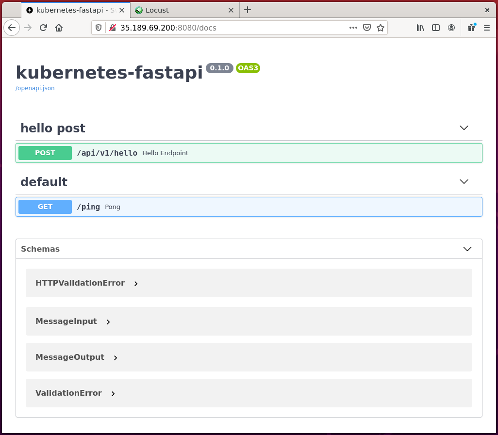
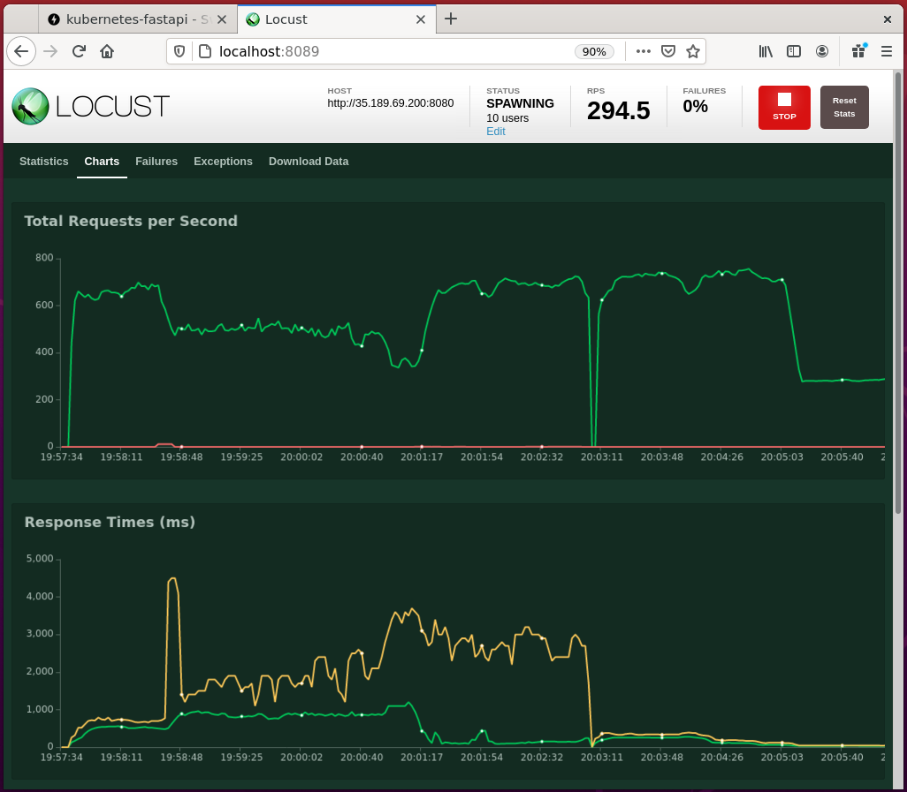

# kubernetes-fastapi

Barebones Python FastAPI in Kubernetes

Built on fastapi-aws-lambda-example (MIT License):

- https://iwpnd.pw/articles/2020-01/deploy-fastapi-to-aws-lambda

## Development setup

To run (in isolation), either:

Run from active Python environment using `uvicorn`:

    pip install -r requirements.txt
    uvicorn service.main:app --host 0.0.0.0 --port 8080 --reload

Or build and run the Docker container:

    docker build -t 4oh4/kubernetes-fastapi:1.0.0 .
    docker run -p 8080:8080 --name kubernetes-fastapi 4oh4/kubernetes-fastapi:1.0.0

Navigate to http://localhost:8080/docs to test the API.

The API responds with a greeting, and the result of a long-running calculation of the largest prime factor of a random integer. You should see a response body similar to:

    {
      "message1": "Hello, world!",
      "message2": "The largest prime factor of 1462370954730 is 398311. Calculation took 0.006 seconds.",
      "n": 1462370954730,
      "largest_prime_factor": 398311,
      "elapsed_time": 0.0057561397552490234
    }

## Push the container image to Docker Hub

If desired, push the container to Docker Hub yourself, and change all references to the image accordingly. Replace "4oh4" with your Docker Hub ID):

    docker push 4oh4/kubernetes-fastapi:1.0.0

You may also need to make the image public as well.

## Google Cloud GKE initial setup

Follow the steps in this section if deploying to Google Cloud GKE, or skip if deploying to a ready-configured Kubernetes cluster. From command line, with [Google Cloud SDK](https://cloud.google.com/sdk/docs/install) installed:

    gcloud components install kubectl

    gcloud config set project my-project-id
    gcloud config set compute/zone europe-west2-a

Create a cluster and get credentials for `kubectl`:

    gcloud container clusters create my-cluster-name --num-nodes=3
    gcloud container clusters get-credentials my-cluster-name

## Kubernetes deployment

    kubectl apply -f api.yaml

If working locally, e.g. using `minikube`, use port forwarding to expose the service:

    kubectl port-forward service/kf-api-svc 8080

To scale the deployment, apply a HorizontalPodAutoscaler. Either:

    kubectl apply -f autoscale.yaml

or:

    kubectl autoscale deployment kf-api --cpu-percent=50 --min=1 --max=10

## Load testing

Use `locust` to simulate a high load on the API

    pip install locust
    locust

## Teardown

    kubectl delete deployment kf-api
    kubectl delete svc kf-api-svc
    kubectl delete hpa kf-api-hpa

## Google Cloud clean-up

    gcloud container clusters delete my-cluster-name

** Check all resources have been deleted in the console - if in doubt, delete the project as well **

## Acknowledgements

Inspiration and code for FastAPI setup:
[How to continuously deploy a fastAPI to AWS Lambda with AWS SAM](https://iwpnd.pw/articles/2020-01/deploy-fastapi-to-aws-lambda).
